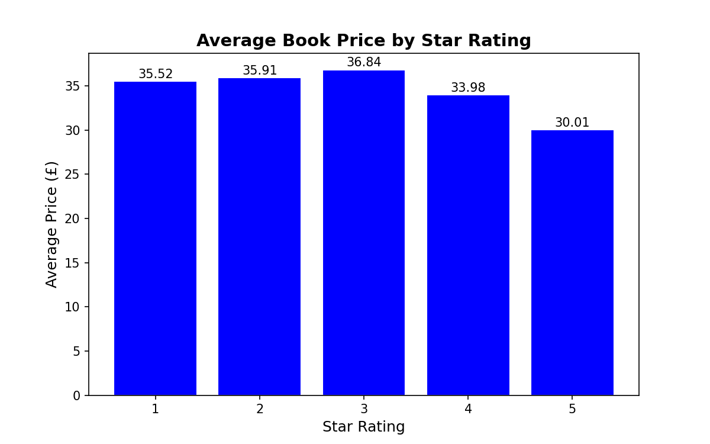
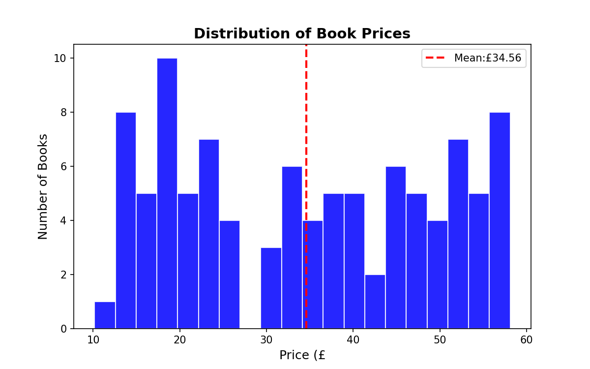
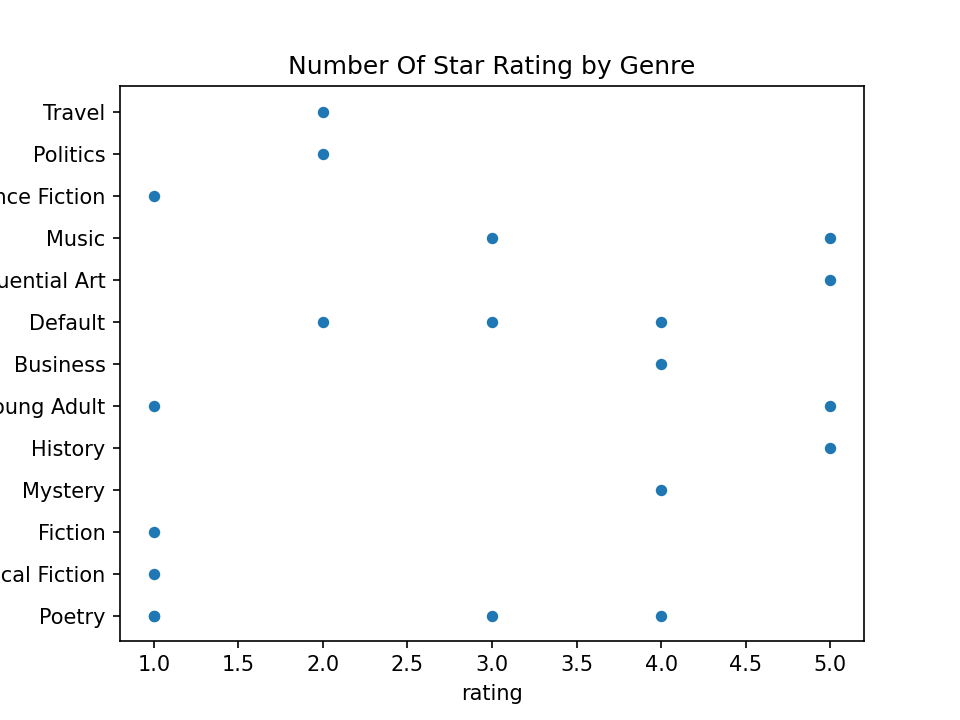

# scraper-project
# Book Scraper + Data Analysis

This is a Python web scraper (my first one ever) that collects book data from books.toscrape.com,
stores it in an SQLite3 database, and performs data analysis with Pandas and matplotlib. 

## Languages and Libraries Used:
- Python 3
- BeautifulSoup4 (web scraping)
- SQLite3 (data storage)
- Pandas (data analysis)
- Matplotlib (visualization)

## Want to take a peek on your own computer?

1. Clone the repo:
   git clone https://github.com/YOUR_USERNAME/book-scraper-analysis.git

2. Install dependencies if you dont already have them installed:
   pip install requests beautifulsoup4 pandas matplotlib

3. Check out the code and insert the functuions you would like to run into main.py

4. Run the project:
   python main.py

## Visualizations

Average book price by star-rating out of 5:

Price distribution histogram:

Number of star-ratings star-rating out of 5 per genre

Any and all feedback is welcomed. Im always trying to find areas where I can improve and feedback (good or bad) is a HUGE part of that. Feel free to send me an email at jakeselvius@gmail.com with questions, comments or feeback!

(please make sure to add a subject related to this project in the email)